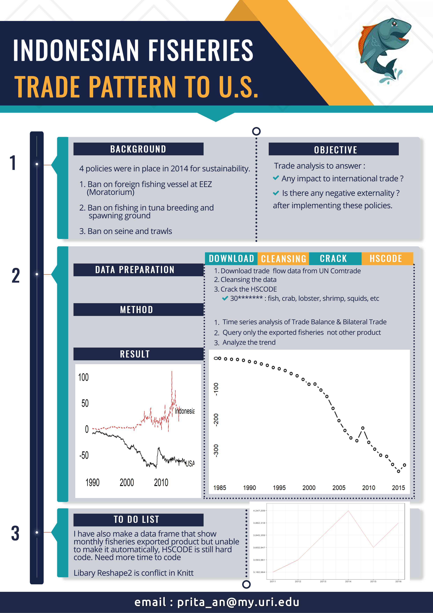

```{r setup, echo=FALSE, warning=FALSE, purl=FALSE, message=FALSE}

# Script for Big Data 
# 2018-05-11
# Author: Prita 

# checks for packages to make sure they are installed
pkgs <- c("ggplot2", "dplyr", "tidyverse")
for(i in pkgs){
  if(!i %in% installed.packages()){
    install.packages(i)
  }
}

# Loads up packages from library
library(ggplot2)
library(dplyr)
library(tidyverse)


theme_set(theme_bw())

#setting the working directory
#setwd("C:/URI/Spring 18/Big Data/final/project/final")
#getwd()

```

# Indonesian Seafood Trade Pattern to the U.S.

##Background

Several policies were in place in 2014 to ensure the sustainability of marine and fisheries resources for generations to come.

* Ban on foreign fishing vessels at Indonesian ZEE (moratorium policy)
* Ban on fishing in tuna breeding & spawning ground 
* Ban on trade of undersized & berried crustaceans 
* Ban on using seine net and trawls 

##Objective
The objective of final project is to answer whether these policies has a bad impact to the export / import (trade).

##Method 
* Data processing and cleansing
1. Download the HSCODE and COUNTRYCODE from the UN Comtrade. Alternatively, using their API.
   HSCODE is Harmonized System (HS), internationally standardized ID to clasify traded      
   product.
2. Understand the pattern of the HSCODE to make it easier detect fisheries as a product
3  Download the trade flow data from Indonesia to US (export) and US to Indonesia (import)
3. Download export data using 4 digit of HSCODE to be able to look at the fisheries. 
4. Download export data using 6 digit of HSCODE to be able to see detail of seafood product.
5. Cleansing the data
6. Find the highest value of exported product from Indonesia 

* Time series analysis
1. Analyse of the trade balance flow between Indonesia and US. Using time series analysis (ts function in R)
2. Analyse of the bilateral trade between Indonesia and US using the same method above. 

* Market Analysis
1. Find the most favorite exported product
2. Dig in to detail of the species. 

##Result 

```{r load, warning=FALSE, message=FALSE}
#load the data 
trade_flow <- read.csv("data/trade_flow.csv")
trade <- read.csv("data/trade.csv")
fish_trade_4_digit <- read.csv("data/uncomtrade_4_hscode.csv")
fish_trade_6_digit_export <- read.csv("data/uncomtrade_6_hscode_export.csv")
fish_trade_6_digit_import <- read.csv("data/uncomtrade_6_hscode_import.csv")
```

###Time Series Analysis : Trade Balance Flow

Trade balance is a difference between the total value of export and total value of imports
* Trade surplus exists when a country exports more than it (imports: X > M)
* Trade deficit exists when a country imports more than it (exports: X < M)

```{r trade_flow}
# time series trade balance flow data using ts function
usa<-ts(trade_flow$Value[trade_flow$LOCATION=="USA"],start=c(1990,1),frequency=12)
ina<-ts(trade_flow$Value[trade_flow$LOCATION=="INA"],start=c(1990,1),frequency=12)
# Plot a Trade Balance Flow
par(mar=c(5,5,2,2),las=1,bty="n",cex.lab=2,cex.axis=2)
plot(usa,axes=FALSE,xlab="",ylab="",xlim=c(1990,2018.5),ylim=c(-80,120),lwd=2)
lines(ina,lty=2,col="firebrick3",lwd=2)
text(2017,ina[305],"Indonesia",cex=1.5)
text(2018.5,usa[329],"USA",cex=1.5)
axis(1,tick=FALSE);axis(2,tick=FALSE,line=-1)
```

###Time Series Analysis : Bilateral Trade (US & Indonesia)

```{r trade}
# Prepare time series bilateral trade data using ts  
im<-ts(trade$Imports,start=c(1985,1))
ex<-ts(trade$Exports,start=c(1985,1))
tb<-ts((ex[-33]-im[-33])/1000,start=c(1985,1))
# Plot figure
plot(tb,axes=FALSE,xlab="",ylab="",type="b",lwd=2)
axis(1,tick=FALSE);axis(2,tick=FALSE,line=-2)
```

### Trend of Export in Fisheries
Two graph before is explaining about all the product (all the HSCODE). In this part, it will only look at the HSCODE 30******* (Fish) and 18******* (Crustacea)


```{r trend}
ggplot(fish_trade_4_digit, aes(x = year, group=1)) +
  labs(x = NULL, y = NULL) + 
  theme(plot.title = element_text(size = 12)) + 
  geom_line(aes(y = fish), colour="#f8766d") 
```

The three graph show the same trend. There is a declining in a major export product and including fisheries. 

### To be continued
Because cracking the UN Comtrade trade data, especially the HSCODE, here i hard code the most exported fisheries product, to get the monthly data and to make a further cost & benefit of the policy that has been implemented and affected to the export / import. 

NOte: i use a couple library that conflict when using knit , so i delete part (like melt, reshape2, and plotting using this function)

```{r detail}
#find the monthly value of the most exported fish (tuna, lobster, crabs, shrimp)
tuna <- fish_trade_6_digit_export  %>% 
  filter(hscode %in% c(302310000, 302320000, 302330000, 302340000, 302390000,
                       303410000, 303420000, 303430000, 303440000, 303460000,
                       303490000, 304870000)) %>%
  select (hscode_desc, val_01, val_02, val_03, val_04, val_05, val_06, val_07, 
          val_08, val_09, val_10, val_11, val_12)

#chart_tuna <- melt(tuna, id = 'hscode')
#names(chart_tuna) <- c('x','func', 'value')

#ggplot(chart_tuna, aes(x)) + geom_line(aes(func, value))

shrimp <- fish_trade_6_digit_export  %>% 
  filter(hscode %in% c(306160000, 306171010, 306171020, 306171090, 306172010, 306172030, 
                       306172090, 306173000, 306179000, 306261000, 306262000, 306263000, 
                       306264900, 306271200, 306271900, 306271200, 306271900, 306272200, 
                       306272900, 306273100, 306273200, 306273900, 306274100, 306274900, 
                       306279900)) %>% 
  select (hscode_desc, val_01, val_02, val_03, val_04, val_05, val_06, val_07, 
          val_08, val_09, val_10, val_11, val_12) 

lobster <- fish_trade_6_digit_export  %>% 
  filter(hscode %in% c(306211000,306212000,306213000,306219900,306221000,306222000,
                       306223000,306229100)) %>% 
  select (hscode_desc, val_01, val_02, val_03, val_04, val_05, val_06, val_07, 
          val_08, val_09, val_10, val_11, val_12) 

crab <- fish_trade_6_digit_export  %>% 
  filter(hscode_desc %in% c(306141000,306149000,306241000,306242000,306249100,306249910,306249990)) %>% 
  select (val_01, val_02, val_03, val_04, val_05, val_06, val_07, 
          val_08, val_09, val_10, val_11, val_12) 

```

###Poster

```{r echo=FALSE, out.width='100%'}

```
